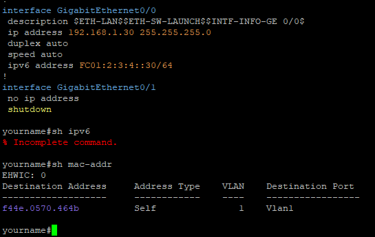

# putty_hlsyn
PuTTY with Cisco/Huawei configs highlight.
This is my attempt to make working with the command line interface of Cisco and Huawei equipment a little more comfortable by adding colors to the black and white console.

## How to turn on
By default, syntax highlighting is disabled so as not to interfere with working with sessions where it is not needed.

To enable for all connections, you need:
1. On the initial settings page, load "Default Settings".
2. Go to the section "Window -> Color -> Colorization", turn on "Enable colorization".
3. Go to the Session section, select "Default Settings", save with the "Save" button.

For a specific connection:
1. On the initial settings page, load session.
2. Go to the section "Window -> Color -> Colorization", turn on "Enable colorization".
3. Go to the Session section, save with the "Save" button.

If there are saved named sessions, then for them you also need to do this procedure.

## Principle of work
The displayed text is analyzed line by line by a list of regular expressions and what will be found is painted in a predefined color.

## Limitations
If a line break occurs in the middle of the search expression, then the regular expression will not work.
To avoid this, make the window as wide as possible so that the text goes in without hyphenation.
In some cases, highlighting occurs in unintended places, for example, if "SNMP OID 1.3.6.2.46.0.2.4" is encountered, some of the numbers will be highlighted, because it is impossible to determine the IP address of this or something else without analyzing the context.

## Version
This is modified version of PuTTY 0.74 from https://www.putty.org/

## Feedback
Comments and suggestions are welcome to putty_hlsyn@list.ru
